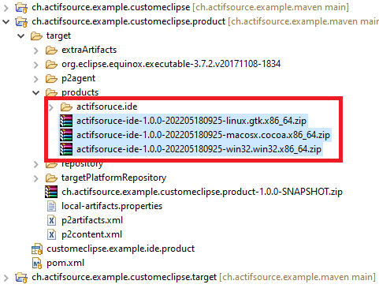

# Build custom actifsource eclipse
In this project we will show how to build a custom actifsoruce eclipse by maven tycho.

|Project|Description|
|---|---|
|ch.actifsource.example.customeclipse|Contains the parent pom.xml|
|ch.actifsource.example.customeclipse.product|Defines the product to build|
|ch.actifsource.example.customeclipse.target|Defines all possible targets|

## Set repository credentials
Add actifsoruce repository credentials to the 'settings.xml' file. ```${user.home}/.m2/settings.xml```

File content:
```<settings>
    <servers>
        <server>
            <id>actifsource-enterprise</id>
            <username></username>
            <password></password>
        </server>
    </servers>
</settings>
```

## Run maven inside Eclipse
Create a new run configuration


## Run maven standalone
Download the maven project (https://maven.apache.org/download.cgi)
and run maven: ``` mvn clean install ``` 

## Build success


The products are now in the folder ```ch.actifsource.example.customeclipse.product\target\products```.


## Requirements
Actifsource Workbench Enterprise Edition

## License
[http://www.actifsource.com/company/license](http://www.actifsource.com/company/license)
