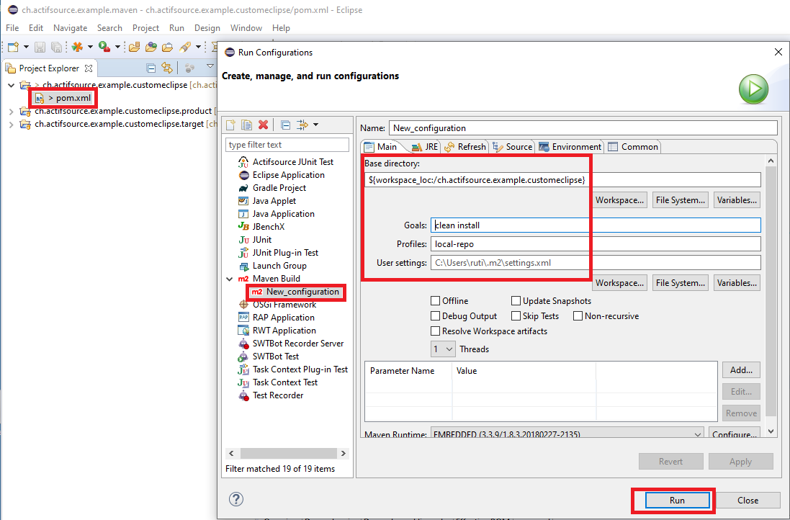

# Build custom actifsource eclipse
In this project we will show how to build a custem actifsoruce eclipse by maven tycho.

|Project|Description|
|---|---|
|ch.actifsource.example.customeclipse|Contains the parent pom.xml|
|ch.actifsource.example.customeclipse.product||
|ch.actifsource.example.customeclipse.target||

## Actifsoruce repository credentials
Add actifsoruce repository credentials to the 'settings.xml' file. (${user.home}/.m2/settings.xml)

Content:
`<settings>
    <servers>
        <server>
            <id>actifsource-enterprise</id>
            <username></username>
            <password></password>
        </server>
    </servers>
</settings>`

## Requirements
Actifsource Workbench Enterprise Edition

## License
[http://www.actifsource.com/company/license](http://www.actifsource.com/company/license)
