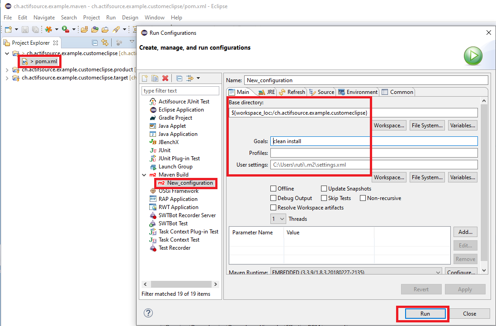
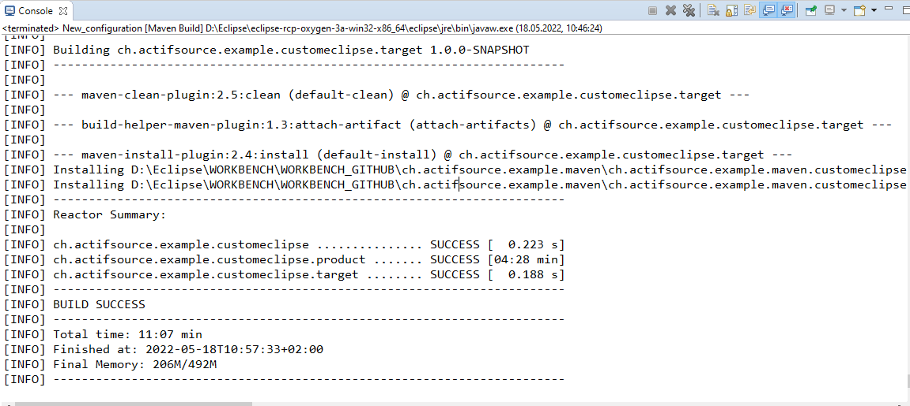

# Build custom actifsource eclipse
In this project we will show how to build a custom actifsoruce eclipse by maven tycho.

|Project|Description|
|---|---|
|ch.actifsource.example.unittest|Contains the parent pom.xml. Define the target eclipse version inside this pom.xml|
|ch.actifsource.example.unittest.feature|Defines the feature from the project to test|
|ch.actifsource.example.unittest.model|Defines the project to test|
|ch.actifsource.example.unittest.model.test|Defines all possible targets|
|ch.actifsource.example.unittest.product|Defines the product to test|
|ch.actifsource.example.unittest.target|Defines all possible targets|

## Set repository credentials
Add actifsoruce repository credentials to the 'settings.xml' file. ```${user.home}/.m2/settings.xml```
Use username and password from the actifsource update site (https://updates.actifsource.com/updates-enterprise).

File content:
```<settings>
    <servers>
        <server>
            <id>actifsource-enterprise</id>
            <username></username>
            <password></password>
        </server>
    </servers>
</settings>
```

## Run maven inside Eclipse
Create a new run configuration


## Run maven standalone
Download the maven project (https://maven.apache.org/download.cgi)
and run maven: ``` mvn clean install ``` or ```run-mvn-local.bat```.

## Build success


## Requirements
Actifsource Workbench Enterprise Edition

## License
[http://www.actifsource.com/company/license](http://www.actifsource.com/company/license)
